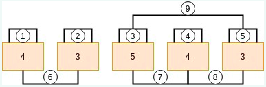

## BACKEND ENGINEER | Software Development Engineer

## Hackerrank Coding Session

### INSTRUCTION

Thank you for your continued interest in Amazon's Software Development Engineer (SDE) opportunities! We are excited to move you forward in the application process. As the next step, we'd like to invite you to complete this online assessment no later than a week from now.

At Amazon, we hire the best minds in technology to innovate and build on behalf of our customers. The intense focus we have on our customers is the reason we are one of the world's most beloved brands – customer obsession is part of our company DNA. Amazonians chart their own path by owning their development, their career, and their future. What unites Amazonians across teams and geographies is that we are all striving to delight our customers and make their lives easier. The scope and scale of our mission drives us to seek diverse perspectives, be resourceful, and navigate through ambiguity. By working together on behalf of our customers, we are building the future one innovative product, service, and idea at a time.

**Overview**

There are 3 types of exercises in the assessment:

1. Coding Challenge – this timed section takes 90 minutes, work through two coding problems.
2. Work Simulation – typically takes 15 minutes, work through software development decisions faced by SDEs at Amazon.
3. Work Style Surveys – typically takes 10 minutes, 2 surveys - answer questions about how you approach software engineering work and your approach to work in general.

### Question 1
Amazon Shopping recently launched a new item whose daily customer ratings for n days is represented by the array ratings. They monitor these ratings to identify products that are not performing well. Find the number of groups that can be formed consisting of 1 or more consecutive days such that the rating continuously decreases over the days.

The rating is consecutively decreasing if it has the form: r, 1-1, r - 2... and so on, where r is the rating on the first day of the group being considered. Two groups are considered different if they contain the ratings of different consecutive days. 

**Example**

ratings = [4, 3, 5, 4, 3]

There are 9 periods in which the rating consecutively decreases.

**5 one day periods:** [4], [3], [5], [4], [3] 

**3 two day periods:** [4, 3], [5,4], [4, 3] 

**1 three-day period:** [5, 4, 3]

These can be visualized in the figure shown below.



**Tests Cases Examples:**
```
Input:
{2,1,3}

Return:
4
```

```
Input:
{4,3,5,4,3}

Return:
9
```

### Question 2