# Section 1(Java MCQS)
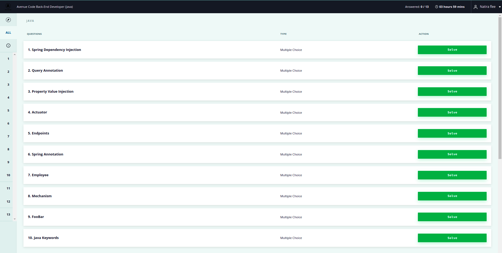

## Question 1
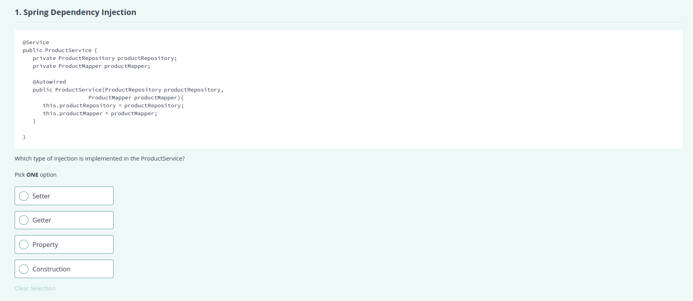
### Answer
Construction


## Question 2

### Answer
@Query

## Question 3
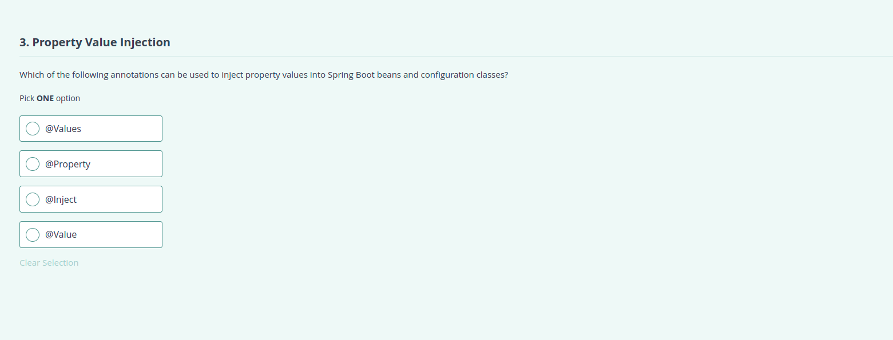
### Answer
@Value

## Question 4

### Answer
application analysis

## Question 5
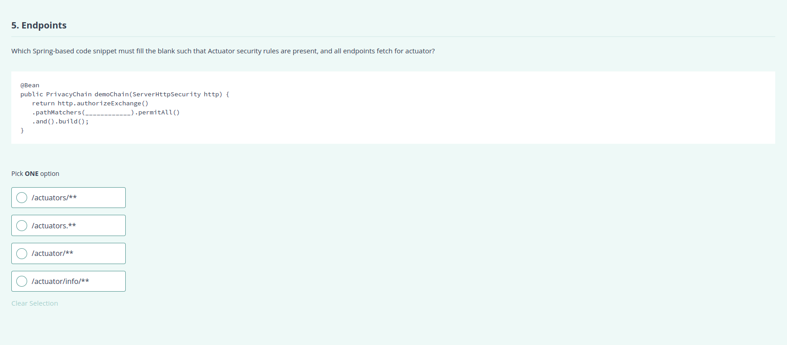
### Answer
/actuator/**

## Question 6

### Answer
It allows Spring to create components.

## Question 7

### Answer
field based

## Question 8

### Answer
@Repository

## Question 9

### Answer
"GET request http://localhost:8080/home/ex/basic/bar"

## Question 10

### Answer
break

# Section 2(Rest API)

## Question 1
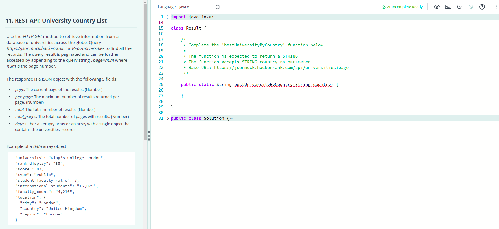
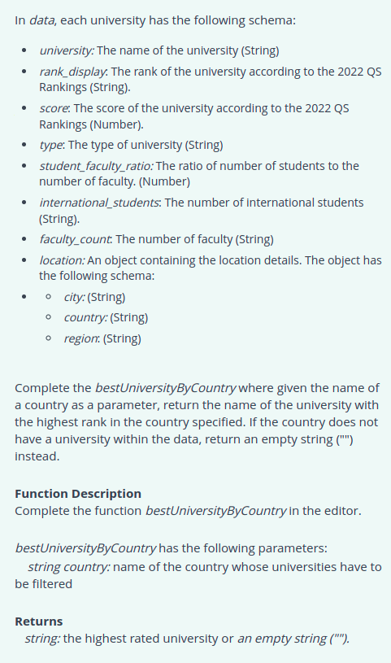

### Description

## Question 2
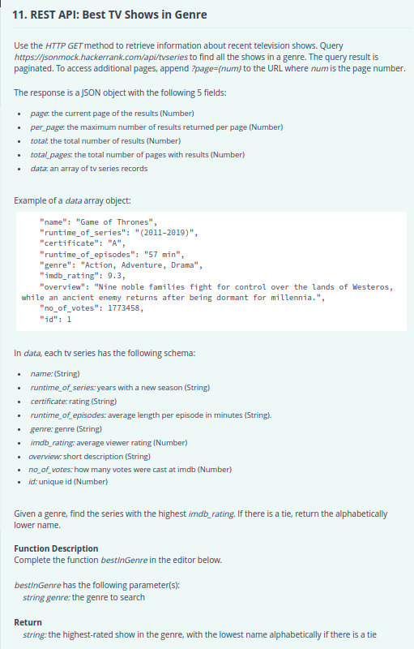

# Section 3(Spring Boot Project)

## Question 1
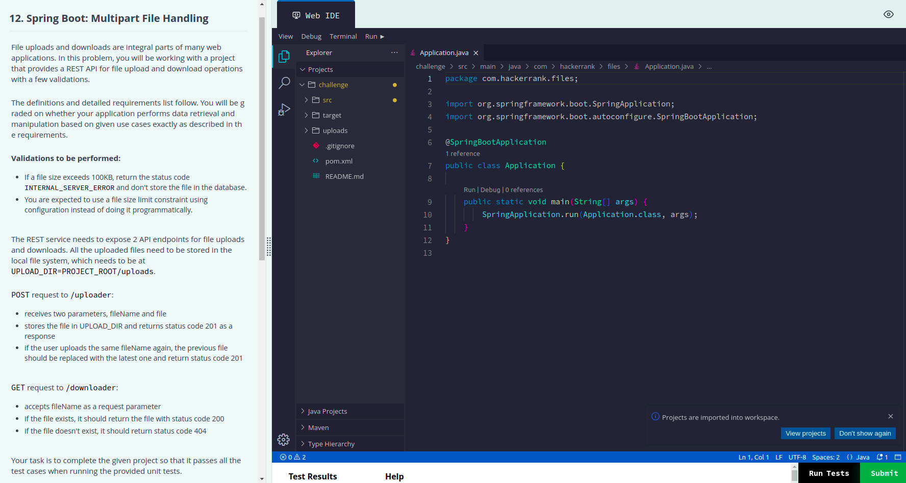
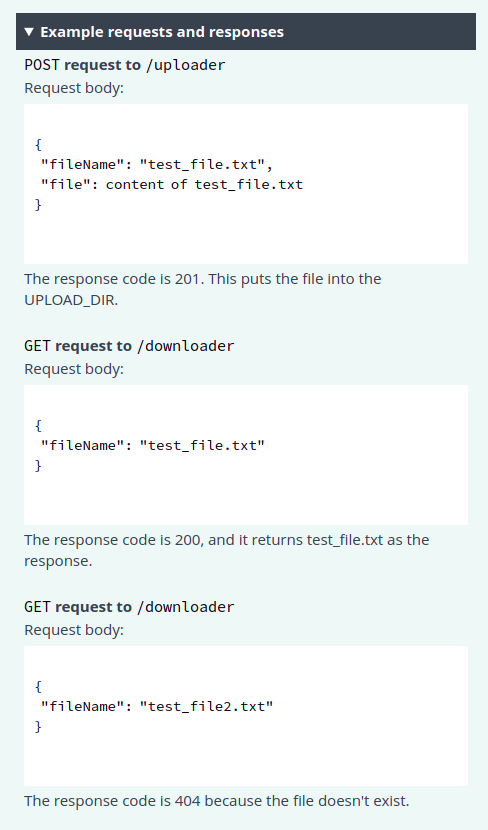
### Description

## Question 2
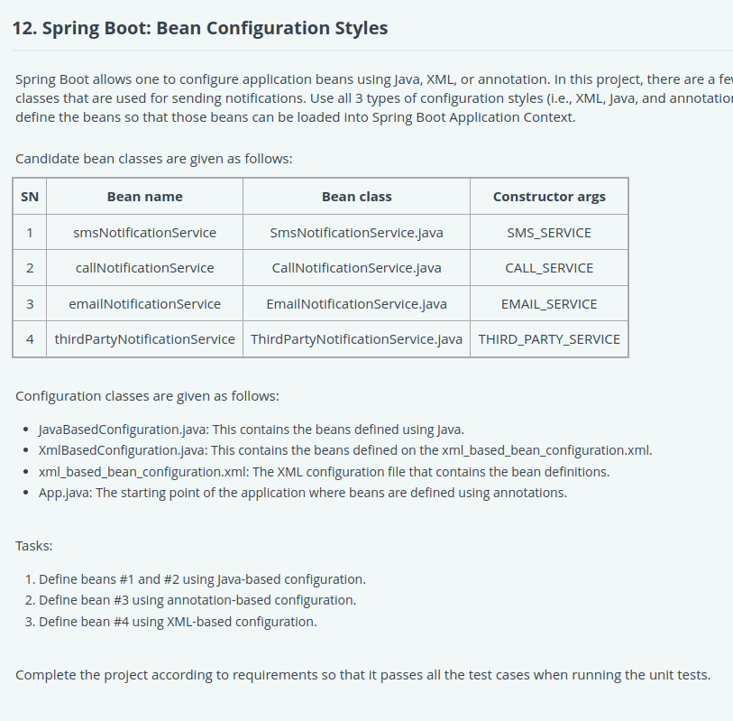
### Solution
```Java
//1. JavaBasedConfiguration
package com.hackerrank.configstyles.javabased;

import org.springframework.context.annotation.Bean;
import org.springframework.context.annotation.Configuration;

import com.hackerrank.configstyles.service.SmsNotificationService;
import com.hackerrank.configstyles.service.CallNotificationService;

@Configuration
public class JavaBasedConfiguration {
    @Bean
    public SmsNotificationService smsNotificationService() {
        return new SmsNotificationService("SMS_SERVICE");
    }

    @Bean
    public CallNotificationService callNotificationService() {
        return new CallNotificationService("CALL_SERVICE");
    }
}

//2. XmlBasedConfiguration
package com.hackerrank.configstyles.xmlbased;

import org.springframework.context.annotation.Configuration;
import org.springframework.context.annotation.ImportResource;

@Configuration
@ImportResource({"classpath*:xml_based_configuration.xml"})
public class XmlBasedConfiguration {
}

//add this in xml_based_bean_configuration.xml
<bean id="thirdPartyNotificationService" class="com.hackerrank.configstyles.service.ThirdPartyNotificationService">
    <constructor-arg value="THIRD_PARTY_SERVICE"/>
</bean>

//3. Modify App.java to this
package com.hackerrank.configstyles;

import org.springframework.beans.factory.annotation.Autowired;
import org.springframework.boot.SpringApplication;
import org.springframework.boot.autoconfigure.SpringBootApplication;
import org.springframework.context.annotation.Bean;

import com.hackerrank.configstyles.service.EmailNotificationService;

@SpringBootApplication
public class App {

    @Autowired
    private EmailNotificationService emailNotificationService;

    public static void main(String[] args) {
        SpringApplication.run(App.class, args);
    }

    @Bean
    public EmailNotificationService emailNotificationService() {
        return new EmailNotificationService("EMAIL_SERVICE");
    }
}
```

# Section 4(Spring Boot Debugging)

## Question 1
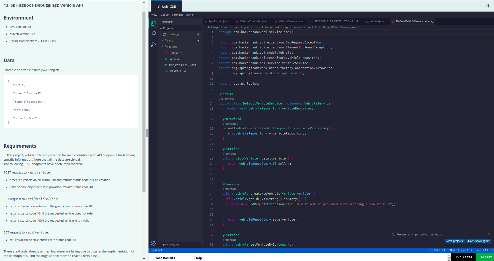
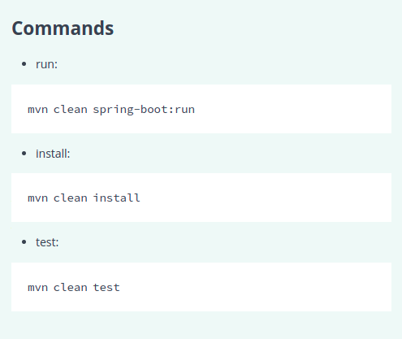
### Solution
3 test cases are failing:
1. ApplicationTests.status400WhenInValidRequest:60 Status expected:<400> but was:<201>
2. ApplicationTests.statusCode200whenExistentRequested:87 Status expected:<200> but was:<404>
3. ApplicationTests.statusCode400WhenInvalidIdRequested:96 Status expected:<400> but was:<404>

- First test case solution is change line 30 of `DefaultVehicleService` from `if (vehicle.getId().toString().isEmpty()) {` to `if (vehicle.getId() != null) {`

- Second test case solution is to change line 35 of `VehicleController` from `@GetMapping(value = "/api/vehicle/{id}")` to `@GetMapping(value = "/vehicle/{id}")`

- Third test case solution is to create `ExceptionHandler` method and `ErrorResponse` class in exception package, following is the implementation:
```java
    public class VehicleController {
        //Some code here
    
        //ExceptionHandler method
        @ExceptionHandler(NumberFormatException.class)
        @ResponseStatus(HttpStatus.BAD_REQUEST)
        public ErrorResponse handleNumberFormatException(NumberFormatException ex) {
            return new ErrorResponse("Invalid vehicle ID: " + ex.getMessage());
        }
    }
    
    //ErrorResponse Class
    public class ErrorResponse {
        private String message;

        public ErrorResponse(String message){
            this.message = message;
        }
    
        public String getMessage() {
            return message;
        }
        
        public void setMessage(String message) {
            this.message = message;
        }
    }
```

## Question 2
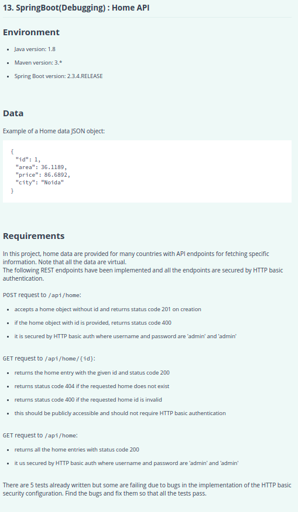
### Solution
5 test cases are failing to fix these modify these
- Modify configure method in SpringSecurityConfig class to this
```java
package com.hackerrank.api.security;

import org.springframework.beans.factory.annotation.Autowired;
import org.springframework.context.annotation.Configuration;
import org.springframework.http.HttpMethod;
import org.springframework.security.config.annotation.authentication.builders.AuthenticationManagerBuilder;
import org.springframework.security.config.annotation.web.builders.HttpSecurity;
import org.springframework.security.config.annotation.web.configuration.EnableWebSecurity;
import org.springframework.security.config.annotation.web.configuration.WebSecurityConfigurerAdapter;

@Configuration
@EnableWebSecurity
public class SpringSecurityConfig extends WebSecurityConfigurerAdapter {

    @Override
    protected void configure(HttpSecurity http) throws Exception {
        http
                .csrf().disable()
                .authorizeRequests()
                .antMatchers(HttpMethod.GET, "/api/home/{id}").permitAll()
                .and()
                .authorizeRequests()
                .anyRequest()
                .authenticated()
                .and()
                .httpBasic();
    }

    @Autowired
    public void configureGlobal(AuthenticationManagerBuilder auth)
            throws Exception {
        auth.inMemoryAuthentication()
                .withUser("admin")
                .password("{noop}admin")
                .roles("ADMIN");
    }
}
```
- In HomeController create ExceptionHandler Method and create new class ErrorResponse in controller package
```java
@ExceptionHandler(NumberFormatException.class)
@ResponseStatus(HttpStatus.BAD_REQUEST)
public ErrorResponse handleNumberFormatException(NumberFormatException ex) {
  return new ErrorResponse("Invalid home Id: " + ex.getMessage());
}

//ErrorResponse class
package com.hackerrank.api.controller;

public class ErrorResponse {
    private String message;

    public ErrorResponse(String message){
        this.message = message;
    }

    public String getMessage() {
        return message;
    }

    public void setMessage(String message) {
        this.message = message;
    }
}
```
- In HomeController modify line 27 to: `if (newRecord.getId() != null) {`
