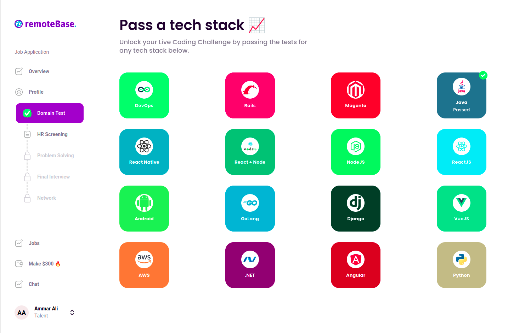
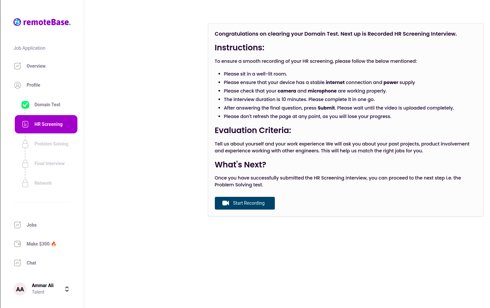
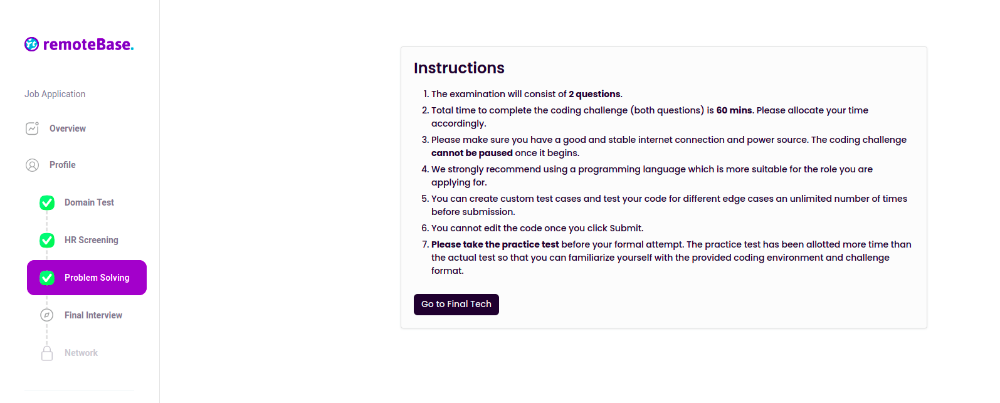
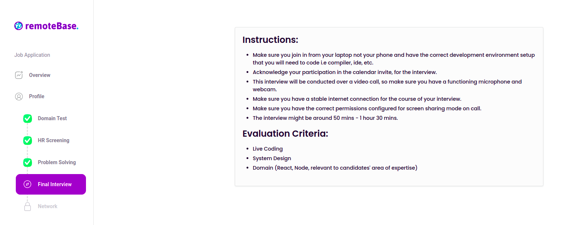

## JAVA DEVELOPER | SENIOR JAVA DEVELOPER | SENIOR BACKEND ENGINEER | SENIOR FULLSTACK ENGINEER
Referral Link: [RemoteBase Link](https://talent.remotebase.com?referral=dM5hFwLY5Weg4P1PJma4DM)

## Domain Test

- Select Java as seen in above screenshot
- Please check the [questions](domain_test) folder to check list of questions asked in previous domain test

## HR Screening

## Problem Solving
Please check the [coding_challenge_hackerrank](coding_challenge_hackerrank) folder to check list of questions asked in previous coding Challenge HackerRank questions

## Final Interview
It's divided into three parts as per experienced:
- **Not Technical - 10 to 15 mins**: (Discuss you, your experience and some behavioural questions or some scenarios)
- **System Design - 20 to 30 mins**: URL Shortening Service or something similar to this
- **Live Coding - 20 to 30 mins**: Please check the [live_coding_interview](live_coding_interview) folder to check list of questions asked in previous interviews

Good luck with the preparation !